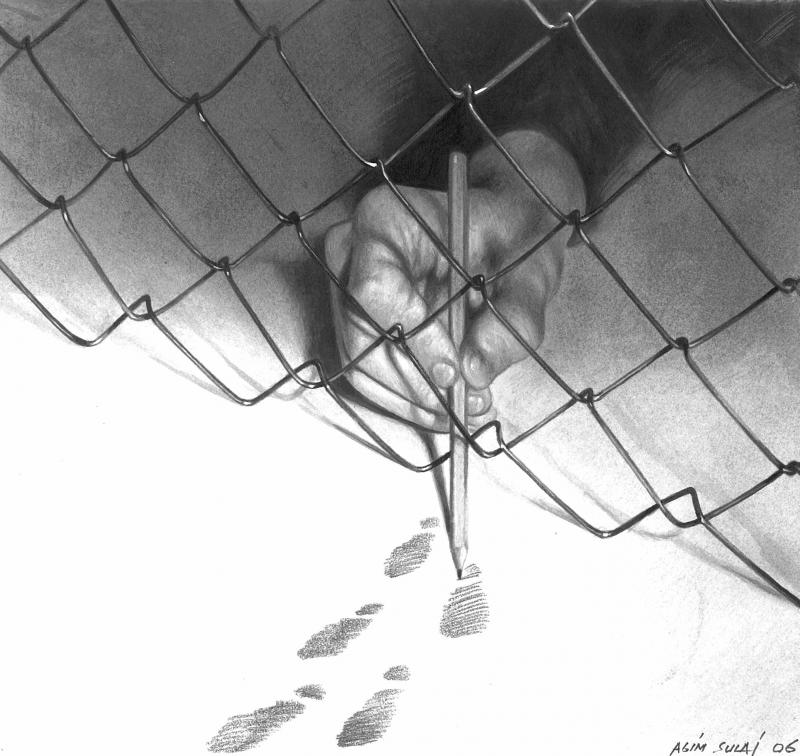

> Imagem de Agim Sulaj (2020), “Liberdade”

A imagem de Agim Sulaj de 2020, intitulada “Liberdade”, parece apresentar o sentimento que nos atinge ao ganharmos liberdade, ao escapar do aprisionamento ou de restrições.

Podemos observar que a cor de fundo de dentro das grades é uma cor mais escura do que o lado de fora passando do preto carregado para um branco ofuscador, por onde tem as pegadas indicando que a ausência de liberdade é uma coisa escura e triste.

O fato de ter uma mão a desenhar um lápis do lado de fora mesmo ainda estando aprisionado sugere que, mesmo estando aprisionado, ainda tem o desejo de escapar e ainda planeia maneiras de escapar para a liberdade.

Realmente só damos valor ao que temos quando perdemos e esta imagem mostra isso com a liberdade. Só a valorizamos quando somos privados dela, seja ela liberdade de expressão, comunicação, pensamento, de ser diferente.